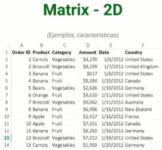

# NUMPY Y PANDAS

[Version en notion](https://www.notion.so/NUMPY-Y-PANDAS-a957cdd7f6814ef4886d3897842d39bc) 

## INTRODUCCIÓN

Vamos a aprender 2 libreriías muy importantes para la manipulación en la ciencia de datos: NumPy y Pandas.

### ¿Por qué NumPy?

Es una librería enfocada al cálculo numérico y manejo de Arrays.

- Creada en el 2005. 100% open source.
- Muy veloz, hasta 50 veces más rápido que usar una lista de Python o C.
- Optimiza el almacenamiento en memoria, lo que ayuda a la velocidad y al manejo de recursos.
- Maneja distintos tipos de datos.
- Es una librería muy poderosa, se pueden crear **redes neuronales** desde cero.

### ¿Por qué Pandas?

Pandas está enfocada a la manipulación y análisis de datos.

- Al estar construido sobre NumPy es veloz.
- Requiere poco código para manipular los datos.
- Soporta múltiples formatos de archivos.
- Ordena los datos en una alineación inteligente (de manera automática).
- Se pueden manejar **grandes cantidades de datos**, hacer analítica y generar dashboards.

### Como importar estas librerías

- Para NumPy:
    
    ```bash
    import numpy as np
    ```
    
- Para Pandas:
    
    ```bash
    import pandas as pd
    ```
    

## NUMPY ARRAY

El array es el principal objeto de la librería. Representa datos de manera estructurada y se puede acceder a ellos a través del indexado, a un dato específico o un grupo de muchos datos específicos.

Para convertir una **lista** en un Array:

```python
lista = [1,2,3,4,5,6,7,8,9]
arr = np.array(lista)
arr
---> [1, 2, 3, 4, 5, 6, 7, 8, 9]
```

- Podemos operar (+, -, *, /, etc) directamente con los elementos.
    
    ```python
    arr[0] + arr[5]
    ---> 7
    ```
    

Una **matriz** son varios Vectores o listas agrupadas una encima de la otra (como una tabla de excel)

Para convertir una matriz en un Array:

```python
matriz = [[1, 2, 3], [4, 5, 6], [7, 8, 9]]
matriz = np.array(matriz)
matriz
---> array([[1, 2, 3],
						[4, 5, 6],
						[7, 8, 9]])
```

- Con las matrices, al indexar una posición se regresa el aaray de dicha posición
    
    ```python
    matriz[0]
    --->array([1,2,3])
    ```
    
- Para seleccionar un solo elemento de la matriz se especifica la posición del elemento separada por comas: el primer elemento selecciona las filas, el segundo elemento las columnas.
    
    ```python
    matriz[0,2]
    --->3
    ```
    

El **indexado** nos permite acceder a los elementos de los array y matrices. Los elementos se empiezan a contar desde 0.

```python
arr[0]
---> 1
```

Con la lista:

| Index | 0 | 1 | 2 | 3 | 4 | 5 | 6 | 7 | 8 |
| --- | --- | --- | --- | --- | --- | --- | --- | --- | --- |
| 0 | 1 | 2 | 3 | 4 | 5 | 6 | 7 | 8 | 9 |

Con la matriz:

| Index | 0 | 1 | 2 |
| --- | --- | --- | --- |
| 0 | 1 | 2 | 3 |
| 1 | 4 | 5 | 6 |
| 2 | 7 | 8 | 9 |

**Slicing (listas):** Nos permite extraer varios datos, tiene un comienzo y un final.

```python
arr[*inicio* *final* *pasos*]
```

```python
arr[1:6]
--->array([2,3,4,5,6])
```

- En este ejemplo trae desde la posición 1 hasta la posición 5 ([1:6)).
- Si no se ingresa el valor de inicio, se toma el inicio como la posición 0.
    
    ```python
    arr[:6]
    --->array([1,2,3,4,5,6])
    ```
    
- Si no se le da una posición final, se regresan todos los elementos hasta el final del array
    
    ```python
    arr[2:]
    --->array([3,4,5,6,7,8,9])
    ```
    
- Se puede trabajar por pasos, por ejemplo, vamos de 3 en 3: regresa la posición 0, 0+3, 3+3 y como no hay posición 6+3 no regresa nada.
    
    ```python
    arr[::3]
    --->array([1,4,7])
    ```
    
- Si le asignamos un valor negativo se regresan los valores comenzando desde la última posición del array.
    
    ```python
    arr[-1]
    ---> 9
    arr[-3:]
    ---> array([7, 8, 9])
    ```
    

**Slicing (matrices):**

- Para acceder a los valores entre filas
    
    ```python
    matriz[1:]
    ---> array([[4, 5, 6],[7, 8, 9]])
    ```
    
- Para acceder a los valores entre filas y columnas
    
    ```python
    matriz[1:, 0:2]
    ---> array([[4, 5],[7, 8]])
    ```
    

### Tipos de datos

Los arrays en NumPy solo pueden contener **UN ÚNICO** tipo de dato, ya que esto es lo que le confiere las ventajas de la optimización de memoria.

- Para consultar el tipo de dato del array:
    
    ```python
    array.dtype
    ```
    
- Si queremos usar otro tipo de dato, lo podemos definir en la declaración del array
    
    ```python
    arr = np.array([1, 2, 3, 4], dtype = 'float64')
    arr.dtype
    ---> dtype('float64')
    arr
    ---> array([1., 2., 3., 4.])
    ```
    
- Si el array ya está definido, lo convertimos así:
    
    ```python
    arr = array.astype(np.*nuevo_tipo*)
    ```
    
    También se puede cambiar a tipo booleano recordando que los números diferentes de 0 se convierten en True
    
    ```python
    arr = np.array([0, 1, 2, 3, 4])
    arr = arr.astype(np.bool_)
    arr
    ---> array([False,  True,  True,  True,  True])
    ```
    
    O en tipo String:
    
    ```python
    arr = np.array([0, 1, 2, 3, 4])
    arr = arr.astype(np.string_)
    arr
    ---> array([b'0', b'1', b'2', b'3', b'4'], dtype='|S21')
    ```
    
    O de String a número (fallará si un elemento no es de tipo número):
    
    ```python
    arr = np.array(['0', '1', '2', '3', '4'])
    arr = arr.astype(np.int8)
    arr
    ---> array([0, 1, 2, 3, 4], dtype=int8)
    ```

[Lista de tipos de datos](https://numpy.org/doc/stable/user/basics.types.html)

### Dimensiones

Con las matrices podemos crear varias dimensiones:

- Scalar: 0 Un solo dato o valor cualquiera sin tener que estar dentro de una estructura o grupo de valores.
    
    ```python
    scalar = np.array(42)
    print(scalar)
    scalar.ndim
    
    ---> 42
    ---> 0
    ```
    
- Vector: Listas de Python.
    
    ```python
    vector = np.array([1, 2, 3])
    print(vector) 
    vector.ndim 
    
    ---> [1 2 3]
    ---> 1
    ```
    
- Matriz: Hoja de cálculo. 2D.
    
    ```python
    matriz = np.array([[1, 2, 3], [4, 5, 6]])
    print(matriz)
    matriz.ndim
    ----[[1 2 3]
        [4 5 6]]
    ---> 2
    ```
    
    
    
    cantidad de ejemplos son las filas y características son las columnas
    
- Tensor: Series de tiempo o imágenes.
    
    ```python
    tensor = np.array([[[1, 2, 3], [4, 5, 6], [7, 8, 9], [10, 11, 12]],[[13, 13, 15], [16, 17, 18], [19, 20, 21], [22, 23, 24]]])
    print(tensor)
    tensor.ndim
    ---> [[[ 1  2  3]
      	[ 4  5  6]
      	[ 7  8  9]
     	[10 11 12]]
    
     	[[13 13 15]
      	[16 17 18]
      	[19 20 21]
            [22 23 24]]]	
    ---> 3
    ```
    
    
    
    comportamiento a través del tiempo es la nueva dimensión.
    
    
    

Para ver las dimensiones que tienen usamos el comando `.ndim`.


Se puede **definir el número de dimensiones** desde la declaración del array.

```python
vector = np.array([1, 2, 3], ndmin = 10)
print(vector) 
vector.ndim 

---> [[[[[[[[[[1 2 3]]]]]]]]]]
---> 10
```

Se pueden **expandir dimensiones** a los array ya existentes con `expand_dims()`.

- axis = 0 hace referencia a las filas.
- axis = 1 hace referencia a las columnas.

```python
expand = np.expand_dims(np.array([1, 2, 3]), axis = 0)
print(expand)
expand.ndim 

---> [[1 2 3]]
---> 2
```

Para **remover/comprimir** las dimensiones que no están siendo usadas.

```python
print(vector, vector.ndim) 
vector_2 = np.squeeze(vector)
print(vector_2, vector_2.ndim)

---> [[[[[[[[[[1 2 3]]]]]]]]]] 10
---> [1 2 3] 1
```

### Crear Arrays

- Generar arrays sin definir previamente una lista
    
    ```python
    np.arange(0,10)
    ---> array([0, 1, 2, 3, 4, 5, 6, 7, 8, 9])
    ```
    
- Definir un tamaño de paso con un tercer argumento
    
    ```python
    np.arange(0,20,2)
    ---> array([ 0,  2,  4,  6,  8, 10, 12, 14, 16, 18])
    ```
    
- Definir estructuras o esquemas (`np.zeros()`)
    
    ```python
    np.zeros(3)
    ---> array([0., 0., 0.])
    np.zeros((10,5))
    ---> array([[0., 0., 0., 0., 0.],
           [0., 0., 0., 0., 0.],
           [0., 0., 0., 0., 0.],
           [0., 0., 0., 0., 0.],
           [0., 0., 0., 0., 0.],
           [0., 0., 0., 0., 0.],
           [0., 0., 0., 0., 0.],
           [0., 0., 0., 0., 0.],
           [0., 0., 0., 0., 0.],
           [0., 0., 0., 0., 0.]])
    ```
    
- De igual manera, tenemos `np.ones()`
    
    ```python
    np.ones(3)
    ---> array([1., 1., 1.])
    ```
    
- Permite generar una array definiendo un inicio, un final y cuantas divisiones tendrá (`np.linspace(*valor_inicio*,*valor_final*,*divisiones*)`)
    
    ```python
    np.linspace(0, 10 , 10)
    --->  array([ 0.,1.11111111,2.22222222,  3.33333333,  4.44444444,
            5.55555556,  6.66666667,  7.77777778,  8.88888889, 10.])
    ```
    
- Podemos crear una matriz con una diagonal de 1 y el resto de 0
    
    ```python
    np.eye(4)
    ----> array([[1., 0., 0., 0.],
           [0., 1., 0., 0.],
           [0., 0., 1., 0.],
           [0., 0., 0., 1.]])
    ```
    
- Generar números aleatorios
    
    ```python
    np.random.rand()
    ---> 0.37185218178880153
    ```
    
- Generar vectores con valores aleatorios (array de una única dimensión)
    
    ```python
    np.random.rand(4)
    ---> array([0.77923054, 0.90495575, 0.12949965, 0.55974303])
    ```
    
- Generar matrices con valores aleatorios
    
    ```python
    np.random.rand(4,4)
    ---> array([[0.26920153, 0.24873544, 0.02278515, 0.08250538],
           [0.16755087, 0.59570639, 0.83604996, 0.57717126],
           [0.00161574, 0.27857138, 0.33982786, 0.19693596],
           [0.69474123, 0.01208492, 0.38613157, 0.609117  ]])
    ```
    
- Generar un número entero aleatorio entre el númeor inicial y el final
    
    ```python
    np.random.randint(*numero_inicial*,*numero_final*)
    ```
    
    También podemos llevarlos a una estructura definida (cada valor es entero aleatorio).
    
    ```python
    np.random.randint(1,15, (3,3))
    ---> array([[ 4,  2,  9],
               [ 5,  7,  8],
               [14, 14,  4]])
    ```
    

### Shape y Reshape

Son 2 funciones muy importantes de los arreglos. La forma de un arreglo nos va a decir con qué estructura se está trabajando (tamaño, manipular, ingresar).

**Shape:** indica la forma del arreglo (cuantas filas y columnas tengo, o dimensiones)

```python
arr = np.random.randint(1,10,(3,2))
arr
---> array([[4, 2],
          [4, 8],
          [4, 3]])
arr.shape
---> (3, 2)

```

**Reshape:** transforma el arreglo mientras se mantengan los elementos

```python
arr.reshape(1,6)
----> array([[4, 2, 4, 8, 4, 3]])
arr.reshape(2,3)
---> array([[4, 2, 4],
          [8, 4, 3]])
```

- Se puede hacer un reshape como lo haría en lenguaje C (toma por filas). Este es el que se suele usar, la base de Python.
    
    ```python
    np.reshape(arr,(2,3), 'C')
    ---> array([[4, 2, 4],
           [8, 4, 3]])
    ```
    
- O como lo haría Fortran (toma por columnas)
    
    ```python
    np.reshape(arr,(2,3), 'F')
    ---> array([[4, 4, 8],
           [4, 2, 3]])
    ```
    
- Además, existe la opción de hacer reshape según como esté optimizado nuestro computador (puede ser C o F)
    
    ```python
    np.reshape(arr,(2,3), 'A')
    ---> array([[4, 2, 4],
           [8, 4, 3]])
    ```
    

**No puedes cambiar la "forma" a la "forma" original del array, si tienes un (3,3) no lo puedes pasar a (4,2). Toca cambiarlo a una forma que respete la cantidad de valores.**

## FUNCIONES PRINCIPALES DE NUMPY

### Máximo

Usamos `.max()`

Podemos regresar los máximos de cada fila o columna especificando el eje: `.max(*eje*)` 

Para saber la posición del elemento con el máximo: `.argmax()`. Si el máximo está repetido solo nos muestra la posición de menor índice.

Si usamos `.argmax(0)` nos indica la posición del valor máximo en cada columna, donde la posición es el índice de la fila.


- Para arrays y matrices es lo mismo
    
    ```python
    arr.max()
    arr.max(0)
    arr.max(1)
    arr.argmax()
    ```
    

### Mínimo

Usamos: `.min()`y todas las opciones de Max.

Podemos saber la distancia entre el valor más bajo con el más alto

```python
arr.ptp() # 17 - 3 ---> 14
matriz.ptp(0)  ---> array([11,  4,  8,  0,  6])
```

### Análisis estadístico

- Ordenar los elementos:
    
    ```python
    arr.sort() ---> array([ 3,  6,  7,  7,  9, 11, 12, 12, 15, 17])
    ```
    
- Obtener  un percentil (el percentil 50 es la mediana).
    
    ```python
    np.percentile(arr, 50) ---> 10.0
    ```
    
- Mediana. Es donde se ubica la mitad de mi distribución o de mi array
    
    ```python
    np.median(arr) ---> 10.0
    np.median(matriz,*eje*)
    ```
    
- Desviación estándar
    
    ```python
    np.std(arr) ---> 4.0853396431631
    ```
    
- Varianza. La desviación estándar elevada al cuadrado es la varianza (** 2 es elevado al cuadrado).
    
    ```python
    np.var(arr) ---> 16.69
    ```
    
- Promedio o media (suma de todo mi array dividido entre la cantidad de valores)
    
    ```python
    np.mean(arr) ---> 9.9
    ```
    

Aplica igual para las matrices pero le agregamos el eje.

### Concatenación

Se puden unir dos arrays

```python
a = np.array([[1,2], [3,4]])
b= np.array([[5, 6],[7,8]])
np.concatenate((a,b), axis = 0)
---> array([[1, 2],
			      [3, 4],
			      [5, 6],
			      [7, 8]])
np.concatenate((a,b), axis = 1)
--->array([[1, 2, 5, 6],
		       [3, 4, 7, 8]])
```

Ambos arrays deben tener la misma dimensión.

### Transpuesta

La transpuesta pone nuestro array en sentido opuesto, si el array original es (1,2), con la transpuesta quedará (2,1).

```python
arr.T
```

### .copy()

`.copy()` nos permite copiar un array de NumPy en otra variable de tal forma que al modificar el nuevo array los cambios no se vean reflejados en array original.

Si bien quería manejar el objeto por aparte se sigue haciendo referencia al mismo objeto en memoria por lo que cualquier cambio que ocurra va a afectar al objeto padre sin o lo hacemos con `.copy()`

Esta función te ayudará a prevenir muchos errores y tener más confianza a la hora e manipular los datos, por lo que siempre que quieras sacar trozos de un array o matriz o tensor o cualquier entidad de NumPy para hacerle modificaciones o cálculos siempre usa el comando `.copy()`.

## CONDICIONES

Las condiciones nos permite hacer consultas más específicas.

Con las condiciones es como usualmente filtramos dataframes o arrays o diferentes objetos de estructuras de datos.

**Ejemplos:**

Tenemos el siguiente array:

```python
arr = np.linspace(1,10,10,dtype='int8')
arr
---> array([ 1,  2,  3,  4,  5,  6,  7,  8,  9, 10], dtype=int8)
```

```python
##Retorna una lista booleana de quienes cumplen la condición:
condicion = arr > 5
condicion
---> array([False, False, False, False, False,  True,  True,  True,  True,
        True])
```

```python
##Retorna solo los valores que cumplan con la condición:
arr[condicion]
---> array([ 6,  7,  8,  9, 10], dtype=int8)
```

```python
##Que cumpla varias condiciones:
arr[(condicion) & (arr<9)]
---> array([6, 7, 8], dtype=int8)
```

```python
##Cambiando valores:
arr[arr>5] = 99
arr
---> array([ 1,  2,  3,  4,  5, 99, 99, 99, 99, 99], dtype=int8)
```

```python
##Usando np.where(*condicion*,*valor_si*, *valor_si_no_se_cumple*)
matriz = array([[19,  4, 43],
       [ 8, 96, 80],
       [ 6, 99, 35]])

np.where(matriz > 50, 0, 1)
--> 
array([[1, 1, 1],
       [1, 0, 0],
       [1, 0, 1]])
```

## OPERACIONES

Existen diferentes operaciones que se pueden usar para los arrays de NumPy

Una lista de Python entiende que quieres duplicar los datos, por ejemplo, y no es lo que buscamos.

Tenemos el siguiente array (para todos los ejemplos)

```python
arr = np.arange(0,10)
arr2 = arr.copy()
arr ----> array([0, 1, 2, 3, 4, 5, 6, 7, 8, 9])
```

### Multiplicación

Multiplicamos cada valor por un vector

```python
arr * 2 
---> array([ 0,  2,  4,  6,  8, 10, 12, 14, 16, 18])

```

### Suma

- suma de vectores:
    
    ```python
    arr + 2 
    ---> array([ 2,  3,  4,  5,  6,  7,  8,  9, 10, 11])
    ```
    
- Suma de dos arrays de igual dimensiones las hace elemento por elemento (funciona igual para las otras operaciones).
    
    ```python
    arr + arr2 
    ---> array([ 0,  2,  4,  6,  8, 10, 12, 14, 16, 18])
    ```
    
    Lo mismo aplica para matrices
    
    ```python
    matriz = arr.reshape(2,5)
    matriz2 = matriz.copy()
    matriz
    ---> array([[0, 1, 2, 3, 4],
          	 [5, 6, 7, 8, 9]])
    matriz - matriz2
    ---> array([[0, 0, 0, 0, 0],
          	 [0, 0, 0, 0, 0]])
    ```
    

### División con un vector

```python
##Como en este caso la primera posición del array es 0, 
##muestra un error pero, no detiene el proceso.
1 / arr

---> RuntimeWarning: divide by zero encountered in true_divide
  """Entry point for launching an IPython kernel.
  
---> array([    inf,   1.  , 0.5 , 0.33333333, 0.25 ,0.2, 0.16666667, 0.14285714, 0.125 , 0.11111111])
```

### Elevar a un vector

```python
arr**2 
---> array([ 0,  1,  4,  9, 16, 25, 36, 49, 64, 81])
```

### Operación punto por punto (producto punto)

Hay 2 maneras de hacerla:

```python
np.matmul(matriz, matriz2.T)
---> array([[ 30,  80],
      	 [ 80, 255]])
```

```python
matriz @ matriz2.T
---> array([[ 30,  80],
       [ 80, 255]])
```

## SERIES Y DATAFRAMES EN PANDAS

La librería de pandas nos ayuda a hacer una mejor exploración y análisis de datos.

Pandas es una librería de Python especializada en el manejo y análisis de estructuras de datos. El nombre viene de “Panel data”.

- Velocidad
- poco código
- Múltiples formatos de archivos
- Alineación inteligente.

### Pandas Series

Es muy parecido a un array de una dimensión (o vector) de NumPy.


- Arreglo unidimensional indexado. Definiendo una **lista con índices específicos**:
    
    ```python
    psg_players = pd.Series(['Navas','Mbappe','Neymar','Messi'], index=[1,7,10,30])
    
    psg_players 
    ---> 1      Navas
         7     Mbappe
         10    Neymar
         30     Messi
         dtype: object
    ```
    
    O creando un diccionario:
    
    ```python
    ##dict es un diccionario
    dict = {1: 'Navas', 7: 'Mbappe', 10: 'Neymar', 30:'Messi'}
    pd.Series(dict)
    ---> 1 Navas
    		7 Mbappe
    		10 Neymar
    		30 Messi
    		dtype: object
    ```
    
- Búsqueda por índices:
    
    ```python
    psg_players[7]
    ----> 'Mbappe'
    ```
    
- Búsqueda mediante Slicing
    
    ```python
    psg_players = pd.Series(['Navas','Mbappe','Neymar','Messi'])
    psg_players[0:3]
    -----> 0     Navas
           1    Mbappe
           2    Neymar
        dtype: object
    ```
    
- Operaciones aritméticas
- Distintos tipos de datos.

### Pandas DataFrame

Muy parecido a las estructuras matriciales trabajadas con NumPy. Es un objeto hecho de arrays pero en una estructura matricial. tenemos filas y columnas (ambas tienen índices).


- Estructura principal
    
    ```python
    ##dict es una estructura de diccionario. Tiene 3 dimensiones en este ejemplo
    dict = {'Jugador':['Navas','Mbappe','Neymar','Messi'],
     'Altura':[183.0, 170.0, 170.0, 163.0],
      'Goles':[2, 200, 150, 500]}
    df_players = pd.DataFrame(dict, index=[1,7,10,30])
    --->   Jugador Altura Goles
            1 Navas    183    2
            7 Mbappe   170    200
            10 Neymar   170    150
            30 Messi    163    500
    ```
    
- Arreglo de dos dimensiones
- Búsqueda por índice a nivel de columnas o filas
    - Columnas: Los índices de las columnas serán los nombres de las columnas
        
        ```python
        df_players.columns
        ---> Index(['Jugador', 'Altura', 'Goles'], dtype='object')
        ```
        
    - Por índice. Los índices de las filas podemos asignarlos manualmente o tomarán un valor muy parecido al indexado en NumPy (0, 1, 2…)
        
        ```python
        df_players.index
        ------> Int64Index([1, 7, 10, 30], dtype='int64')
        ```
        
- Slicing
- Operaciones aritméticas
- Distintos tipos de datos
- Tamaño variable
- Optimiza mucho la memoria

### Leer archivos CSV con Pandas

1. Descargamos el archivo CSV
2. Lo subimos a nuestro proyecto
3. Clic derecho sobre el archivo > copiar dirección o ruta de acceso
    
    
    
4. Escribimos:
    
    ```python
    pd.read_csv('*dirección*.csv')
    ```
    
- En algunas ocasiones el archivo podría estar separado por otro caracter diferente a comas. Para solucionarlo usamos el atributo `sep='*delimitador*'` y ya quedará bien organizado.
    
    ```python
    pd.read_csv('*dirección*.csv', sep=',')
    ```
    
- Para cambiar el encabezado, usamos `header` , que pondrá de encabezado los valores que tenga en esa posición. El header son los datos o características que tengo de mi dataFrame
    
    ```python
    pd.read_csv('*dirección*.csv', header = *posición*)
    ```
    
- Para cambiar el nombre de las columnas usamos `names`
    
    ```python
    pd.read_csv('/work/DataFrames/bestsellers-with-categories.csv',
    header = 0,
    names = ['Namesss', 'Authhhhhor', 'User Rating', 'Reviews', 'Price',
    				 'Year', 'Genre'])
    ```
    

TIP: Si queremos leer una tabla que está en una página web, podemos utilizar la sentencia:

```python
pd.read_html('*link*')
```

### Leer archivos JSON con Pandas

Para agregar un archivo JSON usamos los mismos pasos que para agregar un archivo CSV, pero en el código escribimos:

```python
pd.read_json('*dirección*.json')
```

JSON es un formato que se usa mucho de data no estructurada.

En el archivo JSON utiliza la nomenclatura de llave valor, de esta manera con solo enviarle el archivo JSON lleva la estructura a nivel matricial de manera llave valor.

- Otra manera de llevar los datos de una estructura JSON a una de Pandas es:
    
    ```python
    pd.read_json('*dirección*.json',typ='Series')
    ```
    
    Esto va a indexar una lista con los valores que tengo pero en formato RAW
    

### Filtrado (.loc y .iloc)

Cuando queremos navegar por un dataFrame estas funciones permite filtrar datos de manera más específica.

```python
import pandas as pd
df_books = pd.read_csv('bestsellers-with-categories.csv', sep=',', header=0)
```

- `.loc`: filtra según un **label**
    
    ```python
    df_books.loc[:]
    ---> #muestra todos los datos del dataFrame
    ```
    
    - Mostrar un rango de filas tomando en cuenta el start y el end:
        
        ```python
        df_books.loc[0:4]
        ---> #muestra los datos de la fila 0 a la fila 4 (5 primeras filas)
        ```
        
    - Filtrando por filas y columnas:
        
        ```python
        df_books.loc[0:4, ['Name', 'Author']] 
        ----> #filtra los datos de la fila que va de 0 a 4 y de las
        			#columnas Name y Author
        ```
        
    - Podemos modificar los valores de una columna específica del dataFrame:
        
        ```python
        df_books.loc[:, ['Reviews']] * -1
        ---> #multiplica por -1 todos los valores de la columna Reviews
        ```
        
    - Filtrar datos que cumplan una condición determinada:
        
        ```python
        df_books.loc[:, ['Author']] == 'JJ Smith' 
        ----> #muestra la columna Author con True en los valores que cumplen
        			#la condicion y False para los que no la cumplen
        ```
        
- `.iloc`: Filtra mediante **índices**
    
    ```python
    df_books.iloc[:] 
    ---> #muestra todos los datos del dataframe
    ```
    
    - Filtrar datos según los índices de las filas y las columnas:
        
        ```python
        df_books.iloc[:4, 0:2] 
        ---> #muestra los datos de las filas que van de 0 a 3 y 
        		#las columnas con indices 0 y 1
        ```
        
    - Buscar un dato específico:
        
        ```python
        df_books.iloc[1,3] 
        ---> #muestra el dato alojado en la fila 1 columna 3
        ```
        
    - También podemos modificar los valores como con .loc

### Agregar o eliminar datos

- Mostrar las primeras N líneas del DataFrame
    
    ```python
    df_books.head(*N*)
    ```
    
- Eliminar columnas de la salida pero no del DataFrame. (recordemos que 0 son filas y 1 son columnas)
    
    ```python
    df_books.drop('*Nombre_columna*', axis=1).head(*N*)
    ```
    
    - Para que se borre directamente del DataFrame:
        
        ```python
        df_books.drop('*Nombre_columna*', axis=1,inplace=True)
        ```
        
        O también:
        
        ```python
        df_books = df_books.drop('Nombre_columna', axis=1)
        ```
        
- Eliminar una columna (esta opción es de Python)
    
    ```python
    del df_books['*Nombre_columna*']
    ```
    
- Eliminar filas
    
    ```python
    df_books.drop(*Número_de_fila*, axis=0)
    ```
    
- Eliminar un conjunto de filas mediante una lista
    
    ```python
    df_books.drop([*Número_de_fila1*,*Número_de_fila2*,*Número_de_filaN*], axis=0)
    ```
    
- Eliminar un conjunto de filas mediante un rango
    
    ```python
    df_books.drop(range(*fila_inicial*,*fila_final*), axis=0)
    ```
    
- Agregar una nueva columna con valores NaN (valor no numérico, hay que importar NumPy)
    
    ```python
    df_books['*Nueva_columna*'] = np.nan
    ```
    
- Mostrar el número de filas o columnas que tiene un DataFrame
    
    ```python
    df_books.shape[0] #Para ver el número de filas
    df_books.shape[1] #Para ver el número de columnas
    ```
    
- Agregar valores a una nueva columna
    
    ```python
    data = np.arange(0, df_books.shape[0]) 
    #Esto es crear un array o lista desde cero hasta la penúltima columna
    									
    ```
    
- Crear una nueva columna y agregar los valores almacenados en el array (muy útil para sacar rangos)
    
    ```python
    df_books['Rango'] = data
    ---> #Crea una nueva columna llamada Rango con los valores del array
    ```
    
- Para añadir filas se utiliza la función `append` de Python añadiendo como parámetros una lista, diccionario o añadiendo los valores manualmente. Esta es la mas veloz, consume menos memoria y es mucho más sencillo
    
    ```python
    df_books.append(df_books)
    ---> #Duplica las filas del dataFrame porque se agrega a si mismo
    ```
    

### Manejo de datos nulos

Los datos nulos son dolores de cabeza para este mundo de la ciencia de datos y se van a encontrar mucho en nuestros DataFrames.

Primero creamos datos nulos:

```python
import pandas as pd
import numpy as np

dict = {'Col1':[1,2,3,np.nan],
				'Col2':[4, np.nan,6,7],
				'Col3':['a','b','c', None]}
df = pd.DataFrame(dict)
---> Col1 Col2 Col3
	0   1       4    a
	1   2     NaN    b
	2   3       6    c
	3  NaN      7   None
```

- Identificar valores nulos en un DataFRame:
    
    ```python
    df.isnull()
    ---->    Col1   Col2   Col3
    0       false   false  false
    1       false   true   false
    2       false   false  false
    3       true    false  true
    ```
    
- Identificar valores nulos con un valor numérico:
    
    ```python
    df.isnull()*1
    ---> Col1   Col2   Col3
    0       0      0       0
    1       0      1       0
    2       0      0       0
    3       1      0       1
    ```
    
- Sustituir valores nulos por una cadena:
    
    ```python
    df.fillna('Missing')
    --->  Col1   Col2   Col3
    0       1.0    4.0     a
    1       2.0  Missing   b
    2       3.0    6.0     c
    3       Missing 7.0  Missing
    ```
    
- Sustituir valores nulos por una medida etadística realizada con los valores de las columnas:
    
    ```python
    df.fillna(df.mean()) ##Reemplazamos por la media
    ---->    Col1   Col2   Col3
    0           1      4      a
    1           2      5.667  b
    2           3      6      c
    3           2      7     None
    ```
    
- Sustituir valores nulos por valores de interpolación (asume que está trabajando con una serie y asume el valor):
    
    ```python
    df.interpolate()
    ---->    Col1   Col2   Col3
    0           1      4      a
    1           2      5      b
    2           3      6      c
    3           3      7     None
    ```
    
- Eliminar valores nulos:
    
    ```python
    df.dropna()
    --->  Col1   Col2   Col3
    0       1      4      a
    2       3      6      c
    ```
    
- Para borrar valores nulos de una columna en específico:
    
    ```python
    df.dropna(subset=['*Nombre_columna*'])
    ```
    

### Filtrado por condiciones

Funciona por lógica booleana y retorna los valores que están en “True”. Es muy útil porque en ocasiones queremos filtrar o separar datos.

- Mostrar datos que sean mayores a cierto valor:
    
    ```python
    mayor2016 = df_books['*Nombre_columna*'] > *Valor*
    ```
    
- Filtrar datos en nuestro DataFrame que sean mayores a cierto valor
    
    ```python
    mayor2016 = df_books['*Nombre_columna*'] > *Valor*
    df_books[mayor2016]
    ##Filtra los datos que cumplen con la condición
    ```
    
    También se puede colocar la condición directamente como parámetro
    
    ```python
    df_books[df_books['*Nombre_columna*'] > *Valor]*
    ```
    
- Mostrar los datos que sean igual a cierto valor:
    
    ```python
    genreFiction = df_books['*Nombre_columna*'] == '*Valor*'
    ##Muestra el dataFrame con valores booleanos.
    ```
    
- Filtrado con varias condiciones:
    
    ```python
    df_books[genreFiction & mayor2016]
    ```
    
- Filtrado con negación:
    
    ```python
    df_books[~ mayor2016]
    ```
    

### Funciones principales de Pandas

Hay ciertas funciones que son muy importantes y siempre las estaremos usando a la hora de hacer análisis de datos, para mayor facilidad y comprensión del DataFrame.

- Mostrar las primeras dos líneas de registro
    
    ```python
    df_books.head(2)
    ```
    
- Mostrar los diferentes datos que contiene el DataFrame:
    
    ```python
    df_books.info()
    ---> <class 'pandas.core.frame.DataFrame'>
    RangeIndex: 550 entries, 0 to 549
    Data columns (total 7 columns):
     #   Column       Non-Null Count  Dtype  
    ---  ------       --------------  -----  
     0   Name         550 non-null    object 
     1   Author       550 non-null    object 
     2   User Rating  550 non-null    float64
     3   Reviews      550 non-null    int64  
     4   Price        550 non-null    int64  
     5   Year         550 non-null    int64  
     6   Genre        550 non-null    object 
    dtypes: float64(1), int64(3), object(3)
    memory usage: 30.2+ KB
    ```
    
- Obtener diferentes datos estadísticos de las columnas numéricas:
    
    ```python
    df_books.describe()
    --->  User.Rating  Reviews   Price     Year
    count    550       550       550       550
    mean    4.618   11953.281    13.1      2014
    std     0.226   11731.132    10.84     3.165
    min      3.3        37         0       2009
    25%      4.5      4058         7       2011
    50%      4.7      8580        11       2014
    75%      4.8    17253.25      16       2017
    max      4.9      87841      105       2019
    ```
    
- Mostrar los últimos 5 registros del DataFrame (podemos poner N cantidad de registros, pero por default muestra los últimos 5):
    
    ```python
    df_books.tail()
    ```
    
- Obtener el uso de la memoria de cada columna:
    
    ```python
    df_books.memory_usage(deep=True)
    ```
    
- Obtener cuantos datos tenemos de algo en específico:
    
    ```python
    df_books['*Nombre_columna*'].value_counts()
    ```
    
- Eliminar registros duplicados:
    
    ```python
    df_books.drop_duplicates()
    ```
    
    También se puede eliminar el registro duplicado dejando el último valor:
    
    ```python
    df_books.drop_duplicates(keep='last')
    ```
    
- Ordenar los registros según valores de la oclumna (orden ascendente):
    
    ```python
    df_books.sort_values('*Nombre_columna*')
    ```
    
- Ordenar los registros según valores de la columna (orden descendente):
    
    ```python
    df_books.sort_values('*Nombre_columna*', ascending=False)
    ```
    


[Más funciones: 10 minutes to pandas - pandas 1.5.3 documentation](https://pandas.pydata.org/docs/user_guide/10min.html)

### GroupBy

Permite agrupar datos en función de los demás. Es decir, hacer el análisis del DataFrame en función de una de las columnas. 


La columna que estamos usando para agrupar se convierte en el índice de mi DAtaFrame, por eso queda un poco más abajo que las demás.

- Agrupar por Author y mostrar el conteo de los datos de las demás columnas:
    
    ```python
    df_books.groupby('Author').count() #Cuantos registros hay por autor
    ```
    
    
    
- Agrupar por ‘Author y Year’ y contar los valores de las demás columnas:
    
    ```python
    df_books.groupby(['Author','Year']).count()
    --->                        Name    User Rating    Reviews    Price    Genre
    ('Abraham Verghese', 2010)   1       1     1         1        1
    ('Abraham Verghese', 2011)   1       1      1         1        1
    ('Adam Gasiewski', 2017)     1       1      1         1        1
    ('Adam Mansbach', 2011)      1       1      1         1        1
    ```
    
- Agrupar por Author y mostrar la media de los datos de las demás columnas:
    
    ```python
    df_books.groupby('Author').median()
    ```
    
- Podemos usar loc y acceder a un dato específico del DataFrame (ya que la columna se convierte en el índice).
    - Agrupar por autor y mostrar la suma de los valores de las demás columnas para William Davis
        
        ```python
        df_books.groupby('Author').sum().loc['William Davis']
        ---> 
        User Rating        8.8
        Reviews        14994.0
        Price             12.0
        Year            4025.0
        Name: William Davis, dtype: float64
        ```
        
    - Agrupar por author y mostrar la suma de los valores de las demás columnas. Colocar los índices que el DataFrame trae por defecto con `.reset_index()`
        
        ```python
        df_books.groupby('Author').sum().reset_index()
        --->              Author    User Rating    Reviews    Price    Year 
        0         Abraham Verghese      9.2         9732       22      4021
        1         Adam Gasiewski        4.4         3113       6       2017
        2         Adam Mansbach         4.8         9568       9       2011
        3         Adir Levy             4.8         8170       13      2019
        ```
        
- La función `agg()` permite aplicar varias funciones al DataFrame una vez agrupado según una columna específica.
    - Agrupar por Author y mostrar el mínimo y máximo de las demás columnas (el mínimo y máximo de columnas no numéricas los saca por caracteres)
        
        ```python
        df_books.groupby('Author').agg(['min','max'])
        ---> #muestra cada columna dividida en dos: min y max. 
        #Estas contienen los valores maximo y minimo de la columna
        # para cada Author
        ```
        
    - Agrupar por Author, obtener el mínimo y máximo de la columna ‘Reviews’ y sumar los valores de la columna ‘User Rating’
        
        ```python
        df_books.groupby('Author').agg({'Reviews':['min','max'], 'User Rating':'sum'})
        --->                 Reviews min    Reviews max    User Rating 
        Abraham Verghese         4866           4866          9.2
        Adam Gasiewski           3113           3113          4.4
        Adam Mansbach            9568           9568          4.8
        Adir Levy                8170           8170          4.8
        ```
        

De esta forma podemos hacer múltiples combinaciones agrupando datos ya sea por la llave de agrupamiento o por los resultados que quiero en funciones de agregación.

[Más funcions de agrupamiento en Pandas](https://pandas.pydata.org/docs/reference/api/pandas.DataFrame.groupby.html)

## COMBINANDO DATAFRAMES

Existen diferentes formas de fusionar dos DataFrames. Esto se hace a través de la lógica de combinación:


- Left join: El DataFrame de la izquierda tiene prioridad. Trae siempre los datos de la izquierda y las filas en común con el DataFrame de la derecha.
- Right join: El DataFrame de la derecha tiene prioridad. Trae siempre los datos de la derecha y las filas en común con el DataFrame de la izquierda.
- Inner join: Trae los datos que son común en ambos DataFrame.
- Outer join: Trae los datos del DataFrame de la izquierda y derecha, incluyendo los datos que comparten ambos.

Cuando quiero fusionar 2 DataFrames a nivel de filas uso Concat con axis 0. Va a crecer verticalmente. Si quiero fusionarlo por columnas uso concat con Axis 1 (habrán valores nulos porque la organización por columnas hace un match de manera horizontal).


### Concat

Primero importamos Pandas y Numpy. Para los ejemplos vamos a crear 2 DataFrames nuevos: df1 y df2.

```python
import pandas as ps
import numpy as np
df1 = pd.DataFrame({'A':['A0', 'A1', 'A2','A3'],
						        'B':['B0', 'B1', 'B2','B3'],
										'C':['C0', 'C1', 'C2','C3'],
										'D':['D0', 'D1', 'D2','D3']})

df2 = pd.DataFrame({'A':['A4', 'A5', 'A6','A7'],
										'B':['B4', 'B5', 'B6','B7'],
										'C':['C4', 'C5', 'C6','C7'],
										'D':['D4', 'D5', 'D6','D7']})
```

- Concatenar los DataFrames:
    
    ```python
    pd.concat([df1,df2])
    ---> A  B   C   D
    0   A0  B0  C0  D0
    1   A1  B1  C1  D1
    2   A2  B2  C2  D2
    3   A3  B3  C3  D3
    0   A4  B4  C4  D4
    1   A5  B5  C5  D5
    2   A6  B6  C6  D6
    3   A7  B7  C7  D7
    ```
    
- Corregir los índices (con esto los respeta y reorganiza. Por default este lo hace con Axis 0):
    
    ```python
    pd.concat([df1,df2], ignore_index= True)
    ---> A  B   C   D
    0   A0  B0  C0  D0
    1   A1  B1  C1  D1
    2   A2  B2  C2  D2
    3   A3  B3  C3  D3
    4   A4  B4  C4  D4
    5   A5  B5  C5  D5
    6   A6  B6  C6  D6
    7   A7  B7  C7  D7
    ```
    
- Por axis 1 (es muy raro de hacerlo de esta manera):
    
    ```python
    pd.concat([df1,df2], axis = 1)
    ---> A  B   C   D   A.1 B.1 C.1 D.1
    0   A0  B0  C0  D0  A4  B4  C4  D4
    1   A1  B1  C1  D1  A5  B5  C5  D5
    2   A2  B2  C2  D2  A6  B6  C6  D6
    3   A3  B3  C3  D3  A7  B7  C7  D7
    ```
    

### Merge

Merge puede unificar DataFrames en base a los índices o a los valores de las columnas.

Primero importamos Pandas y Numpy y creamos el DataFrame.

```python
import pandas as pd
import numpy as np
izq_1 = pd.DataFrame({'key' : ['k0', 'k1', 'k2','k3'],
										 'A' : ['A0', 'A1', 'A2','A3'],
										 'B': ['B0', 'B1', 'B2','B3']})
der_1 = pd.DataFrame({'key' : ['k0', 'k1', 'k2','k3'],
											'C' : ['C0', 'C1', 'C2','C3'],
											'D': ['D0', 'D1', 'D2','D3']})

izq_2 = pd.DataFrame({'key' : ['k0', 'k1', 'k2','k3'],
											 'A' : ['A0', 'A1', 'A2','A3'],
											 'B': ['B0', 'B1', 'B2','B3']})
der_2 = pd.DataFrame({'key_2' : ['k0', 'k1', 'k2','k3'],
											 'C' : ['C0', 'C1', 'C2','C3'],
											 'D': ['D0', 'D1', 'D2','D3']})
											
izq_3 = pd.DataFrame({'key' : ['k0', 'k1', 'k2','k3'],
											 'A' : ['A0', 'A1', 'A2','A3'],
											 'B': ['B0', 'B1', 'B2','B3']})

der_3 = pd.DataFrame({'key_2' : ['k0', 'k1', 'k2',np.nan],
												 'C' : ['C0', 'C1', 'C2','C3'],
												 'D': ['D0', 'D1', 'D2','D3']})
```

- Unir el DataFrame Der a Izq (el DataFrame de la derecha siempre es el que está dentro de los paréntesis):
    
    ```python
    izq_1.merge(der_1)
    ---> key A  B   C   D
    0   k0  A0  B0  C0  D0
    1   k1  A1  B1  C1  D1
    2   k2  A2  B2  C2  D2
    3   k3  A3  B3  C3  D3
    ```
    
- Hay diferencias entre algunas columnas, por esa razón hay que separarlos de esta manera:
    
    ```python
    izq_2.merge(der_2, left_on = 'key', right_on='key_2')
    ---> key A  B   key_2   C   D
    0   k0  A0  B0  k0    C0  D0
    1   k1  A1  B1  k1    C1  D1
    2   k2  A2  B2  k2    C2  D2
    3   k3  A3  B3  k3    C3  D3
    #Sin un how, esto es un inner join
    ```
    
- Si tenemos un NaN en nuestro DataFrame, pandas no lo detectará como un match. Se soluciona con `how`, dando así, una preferencia:
    
    ```python
    izq_3.merge(der_3, left_on = 'key', right_on='key_2', how='left')
    ---> key A  B   key_2   C   D
    0   k0  A0  B0  k0    C0  D0
    1   k1  A1  B1  k1    C1  D1
    2   k2  A2  B2  k2    C2  D2
    3   k3  A3  B3  NaN  NaN  NaN
    ##Esto hace un left join porque así lo especificamos en el left.
    #Trae todos los datos de la izquierda y solo los datos que coincidan
    #con la llave key en key_2.
    izq_3.merge(der_3, left_on = 'key', right_on='key_2',how='right')
    --->key	A	B	key_2	C	D
    0	k0	A0	B0	k0	C0	D0
    1	k1	A1	B1	k1	C1	D1
    2	k2	A2	B2	k2	C2	D2
    3	NaN	NaN	NaN	NaN	C3	D3
    #Este es un right join.
    ```
    

### Join

Es otra herramienta para hacer exactamente lo mismo, una combinación. La diferencia es que join va a ir a los índices y no a columnas específicas.

```python
izq = pd.DataFrame({'A': ['A0','A1','A2'],
  'B':['B0','B1','B2']},
  index=['k0','k1','k2'])

der =pd.DataFrame({'C': ['C0','C1','C2'],
  'D':['D0','D1','D2']},
  index=['k0','k2','k3'])
```

- Combinamos izq con der (left join)
    
    ```python
    izq.join(der)
    ---> A  B   C   D
    k0  A0  B0  C0  D0
    k1  A1  B1  nan nan
    k2  A2  B2  C1  D1
    ```
    
- Traer todos los datos aunque no hagan match (outer join)
    
    ```python
    izq.join(der, how = 'outer')
    ---> A  B   C   D
    k0  A0  B0  C0  D0
    k1  A1  B1  nan nan
    k2  A2  B2  C1  D1
    k3  nan nan C2  D2
    ```
    
- Traer solo los datos que hacen match (inner join)
    
    ```python
    izq.join(der, how = 'inner')
    ---> A	B	C	D
    k0	A0	B0	C0	D0
    k2	A2	B2	C1	D1
    ```
    

## PIVOT Y MELT

Son dos funciones que sirven para cambiar la estructura de nuestro DataFrame de acuerdo a nuestras necesidades.

### Pivot_table

Pivot, basicamente, transforma los valores de determinadas columnas o filas en los índices de un nuevo DataFrame, y la intersección de estos es el el valor resultante.

```python
*DataFrame*.pivot_table(index='*Columna_A*',columns='*Columna_B*',values='*Columna_C*')
## Columna_A: columna que se va a convertir en el índice por fila.
## Columna_B: Columna que va a tomar los valores de cada fila y los convertirá
### en nuevas columnas (índices por columna).
## Columna_C: columna de donde las columnas nuevas creadas con la información
### en Columna_B van a extraer información.
```

- Usando función de agrupamiento (aggfunc):
    
    ```python
    
    *DataFrame*.pivot_table(index='*Columna_A*',
    											columns='*Columna_B*',
    											values='*Columna_C*',
    											aggfunc='*operacion*')
    ```
    

### Melt

Toma las columnas del DataFrame y las pasa a filas, con dos nuevas columnas para especificar la antigua columna y el valor que traía.

```python
*DataFrame*[['Columna_1','Columna_2']].melt()
##Cada resultado de las dos clolumnas pasa a una fila 
## de este modo a tipo **llave:valor**
```

También podemos seleccionar las columnas que no quiero hacer melt usando el parámetro `id_vars`,

```python
*DataFrame*.melt(id_vars='Columna_3',value_vars='Columna_4','Columna_5')
## En este caso hacemos melt con la columna_4 y columna_5, y NO hacemos
## melt a la Columna_3
```

## APPLY

Es un comando muy poderoso que nos deja aplicar funciones a nuestro DataFrame.

Es mucho más eficiente que utilizar algún for.

```python
*DataFrame*['*Columna_A*'].apply(*Nombre_funcion*)
## Esto aplica la función *Nombre_funcion* a todos los valores de la *Columna_A*
```

- Podemos guardarlo en una columna nueva:
    
    ```python
    *DataFrame*['*Nueva_columna*'] = *Data_frame*['*Columna_A*'].apply(*Nombre_funcion*)
    ```
    
- Podemos crear lambda functions:
    
    ```python
    *DataFrame*['*Nueva_columna*'] = *Data_frame*['*Columna_A*'].apply(lambda x: x* 3)
    ##Multiplica todos los valores por 3
    ```
    
- Apply en varias columnas con condiciones, hay que especificar a que los vamos a aplicar (filas o columnas)
    
    ```python
    *DataFrame*.apply(lambda x: x['*Columna_A*'] * 2 if x['*Columna_B*'] == '*Valor*' 
    								else x['*Columna_A*'], axis = 1)
    ---> Multiplica por 2 a los datos que cumplan la condición
    ## El axis es 1 porque estamos haciendo referencia a las columnas.
    ```
    
    Cuando escribimos `*DataFrame*.apply(...)` estamos aplicando el comando en todo el DataFrame y no solo a una columna.